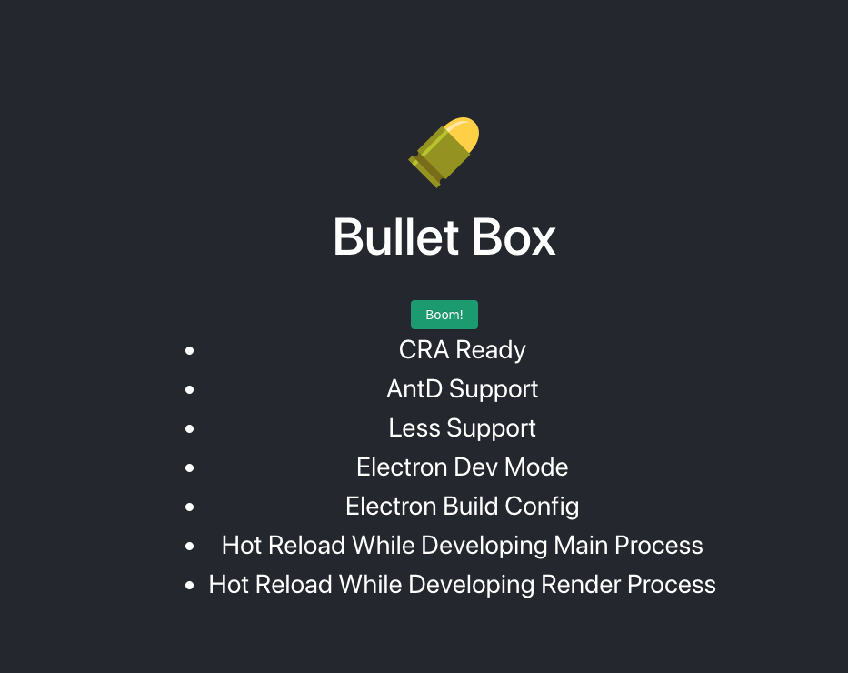

# Bullet Box
Your Personal Code Manager, without uploading code repeatedly, just push one key.

> Attention: branch template is for developing Electron apps with React,Less,AntD.

### 注意

* 开发时用的 /public/electron.js，打包的时候是 /public/electron.js
* 打包应用程序的时候别开VPN，可能会报错。

### 要点

* 改变main里和shared里的代码只重新加载窗口
* 改变renderer里的代码更新窗口里面的页面

### npm 命令释义

* web-dev: 浏览器打开，开发h5
* electron-web-dev: electron打开，开发h5
* electron-main-dev: electron打开，开发主进程
* main-build：打包主进程文件
* main-build-run：打包主进程文件并直接运行（采用打包后的h5）
* electron-dev：electron打开，同时开发h5和主进程
* build：h5打包
* clear: 删除历史构建包
* refresh: 重装依赖